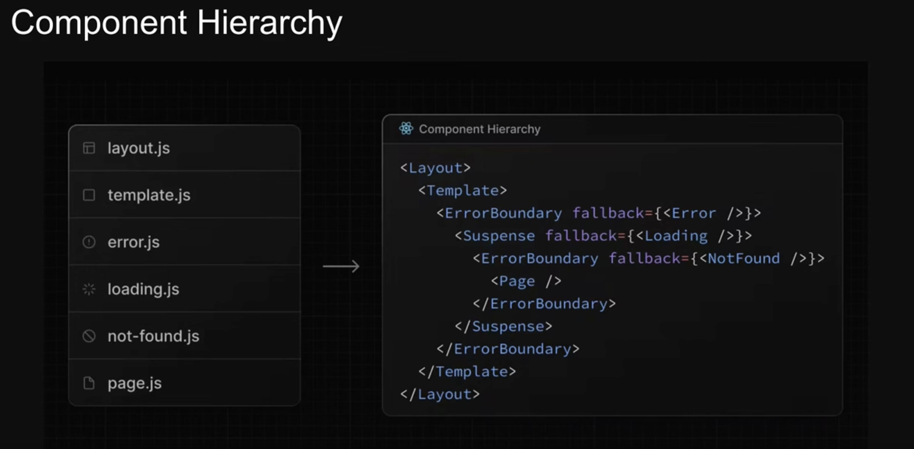

Learn nextjs 14 in `Next.js Tutorial for Beginners`

Link tutorial: `https://www.youtube.com/watch?v=kO2nTCgcJLc&list=PLC3y8-rFHvwjOKd6gdf4QtV1uYNiQnruI&index=11`

Routing metadata:

- Ensuring proper search engine optimization (SEO) is crucial for increasing visibility and attracting users
- Next.js introduced the Metadata API which allows you to define metadata for each page.
- Metadata ensures accurate and relevant information is displayed when your pages are shared or indexed

The title field's primary purpose is to defined the document title
It can be either a string or an object

Special Files:

- page.tsx
- layout.tsx
- template.tsx
- not-found.tsx
- error.tsx
- loading.tsx: this file allows us to create loading states that are displayed to users while a specific route content is loading. The loading state appears immediately upon navigation, giving users the assurance that the application is responsive and actively loading content.

Benefits Loading:

1. You can display the loading state as soon as a user navigates to a new route
   The immediate feedback reassures users that their action has been acknowledged, reduces perceived loading times, and makes the application feel more responsive
2. Next.js allows the creation of shared layouts that remain interactive while new route segments are loading. User can continue interacting with certain parts of the application, such as a naigation menu or sidebar, even if the main content is still being fetched

Benefits Error:

1. Automatically wrap a route segment and its nested children in a React Error Boundary
2. Create error UI tailored to specific segements using the file-system hierarchy to adjust granularity
3. Isolate errors to affected segments while keeping the rest of the application functional.
4. Add functionality to attempt to recover from an error without a full page reload.

Component Hierarchy

